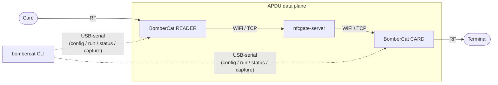

# End-to-end usage

The real workflow: bring up an NFCGate relay on hardware and drive it from the
CLI. Two topologies are supported and validated on hardware (docs/NFCGATE_PLAN.md §15):

- **Path A** — two BomberCats (reader + card) joined by an `nfcgate-server`.
- **Path B** — one BomberCat against the **NFCGate Android app** as the other
  peer (both variants: BomberCat as reader or as card).

**Control plane only.** Everything the CLI does below travels over USB-serial as
text control commands. The actual APDUs never touch serial — they go over
WiFi/TCP between the two peers through the `nfcgate-server`:



## 0. Prerequisites

- Both boards flashed with the **NFCGate relay firmware** and answering the
  handshake (`bombercat device info` shows a `fw` version and `state idle`).
  Check what each one is running with `bombercat status`, and flash it from the
  CLI if it isn't NFCGate:
  ```sh
  bombercat flash NFCGate -d 1       # download the published .uf2 and write it
  bombercat flash NFCGate -d 2
  ```
  See [`flash`](reference.md#flash). For wiring, the board profile, or to build
  the firmware from source, see
  [`firmware/NFCGate/README.md`](../../firmware/NFCGate/README.md).
  - The PN7150 pins are the BomberCat defaults; no extra wiring is needed.
  - The firmware must boot into the control REPL, i.e. `RELAY_AUTOSTART = 0`
    (the default). With `RELAY_AUTOSTART = 1` and a non-empty SSID the board
    blocks on WiFi bring-up before the REPL starts and the CLI can't reach it.
- A reachable `nfcgate-server`. For a bench setup, run the local one:
  ```sh
  bombercat testserver run           # Docker, host :5566
  ```
  Both peers point at this host:port. (Real deployments use any reachable
  `nfcgate-server` — the app's default public server, or your own.)
- The two boards usually share one host over USB. List and address them by ID:
  ```sh
  bombercat device list
  ```

---

## Path A — two BomberCats via `nfcgate-server`

One board reads a physical card (`reader`), the other emulates it to a terminal
(`card`). Both share the same `--server` and `--session`.

### 1. Configure both ends from one terminal

```sh
# WiFi (same network for both)
bombercat relay config wifi -d 1 --ssid MyNet --pass 's3cret'
bombercat relay config wifi -d 2 --ssid MyNet --pass 's3cret'

# nfcgate: same server + session, opposite roles
bombercat relay config nfcgate -d 1 --server 192.168.1.5:5566 --session 42 --role reader
bombercat relay config nfcgate -d 2 --server 192.168.1.5:5566 --session 42 --role card
```

Each `config` blinks the LED of the board it configured, so you can confirm which
physical board is `-d 1` vs `-d 2`. Not sure which is which beforehand?
`bombercat identify -d 1` blinks that board's LED.

Confirm:

```sh
bombercat relay config show -d 1
bombercat relay config show -d 2
```

### 2. Start the relay on both

`run` blocks until each board reaches `relaying` (or reports an error / times
out):

```sh
bombercat relay run -d 1        # reader
bombercat relay run -d 2        # card
```

A relay is live once **both** peers are up: `status` shows `state relaying`,
`link connected yes`, and `peer present yes`.

```sh
bombercat relay status -d 1
bombercat relay status -d 2
```

### 3. Watch it

Present the physical card to the reader board and a terminal to the card board.
Watch either side live:

```sh
bombercat relay monitor -d 1     # reader side
```

You'll see the relay logs and the per-APDU hex dumps as an EMV transaction flows
(e.g. `2PAY.SYS.DDF01` on the first `SELECT`).

### 4. Capture the APDUs

See [Capture / Wireshark](capture.md) for the full story. Quick version — capture
each side in its own terminal:

```sh
bombercat capture start -d 1 -ws           # reader side (pre-mutation APDU)
bombercat capture start -d 2 -ws -o emv.pcap  # card side (post-mutation) + file
```

Ctrl-C stops and disarms the tap.

### 5. Stop

```sh
bombercat relay stop -d 1
bombercat relay stop -d 2
```

---

## Path B — against the NFCGate Android app

Here the phone running the NFCGate app is one peer and a single BomberCat is the
other. Both variants work:

- **B1** — BomberCat `reader` (reads a physical card) + phone as `card`/HCE.
- **B2** — BomberCat `card` (emulates to a terminal) + phone as `reader`.

Setup is the same as Path A, but you only configure and run the **one**
BomberCat, and the phone provides the matching opposite role on the same server
and session:

```sh
# B1 example: BomberCat is the reader
bombercat relay config wifi    --ssid MyNet --pass 's3cret'
bombercat relay config nfcgate --server <server-host>:5566 --session 42 --role reader
bombercat relay run
bombercat relay status          # peer present yes  once the phone joins the session
bombercat relay monitor
```

In the NFCGate app, point it at the same `nfcgate-server`, set the same session,
and pick the opposite role (card/HCE for B1, reader for B2). The BomberCat's
`status` flips `peer present` to `yes` when the app joins the session — there is
no explicit join handshake on the wire; associating with a session is implicit in
sending the first frame (see [protocol](protocol.md) and
[`firmware/core/proto/UPSTREAM.md`](../../firmware/core/proto/UPSTREAM.md)).

---

## Detecting NFC tags with DetectTags

A different workflow from the relay above — one board, no `nfcgate-server`,
no second peer. Flash **DetectTags** and read tags directly with the
PN7150 the BomberCat carries onboard:

```sh
bombercat status                # confirm DetectTags is flashed (or flash it)
bombercat flash DetectTags -d 1 # if it isn't

bombercat tags read             # wait for one tag, print its UID and exit
bombercat tags watch            # stream detections until Ctrl-C
bombercat tags scan -t 20       # sample for 20s, print an aggregated summary
bombercat tags info             # firmware version + which event format it speaks
```

Full flag reference and sample output: [`tags`](reference.md#tags).

Two things worth knowing going in:

- **Every published `.uf2` today parses as legacy text**, not the newer
  structured `:tag` events — same detections, just without the `extra`
  fields the structured format can carry. `bombercat tags info` tells you
  which mode a given board is in.
- **NFC-B and NFC-F tags print no UID on today's published `.uf2`** — that's
  a firmware limitation, not a CLI bug. `tags` reports it honestly as
  `unavailable (NFC-B: firmware prints no ID)` rather than a blank or a
  made-up value. A `DetectTags.ino` update that extracts the real UID for
  both (PUPI for NFC-B, IDm for NFC-F) exists in the firmware source but
  isn't in a published release yet — boards built from that source report
  the real UID (plus `attrib`/`bitrate` extras) instead.

See [Troubleshooting](troubleshooting.md#no-tags-detected) if `watch`/`scan`
looks quiet with a card actually on the reader.

---

## Detecting NFC readers/terminals with DetectReaders

The mirror image of the workflow above: instead of reading tags, the board
*presents itself as one* (card-emulation mode) and reports every
reader/terminal that comes close enough to probe it — useful for spotting an
unexpected POS terminal or skimmer-style reader nearby.

```sh
bombercat status                    # confirm DetectReaders is flashed (or flash it)
bombercat flash DetectReaders -d 1  # if it isn't

bombercat readers read              # wait for one reader, print its fingerprint and exit
bombercat readers watch             # stream detections until Ctrl-C
bombercat readers scan -t 20        # sample for 20s, print an aggregated summary
bombercat readers info              # firmware version + whether events have been seen
```

Full flag reference and sample output: [`readers`](reference.md#readers).

Unlike `tags`, there is no legacy text mode to worry about — DetectReaders
was born speaking the structured `:reader` event line, so every published
`.uf2` parses the same way. The first APDU a reader sends drives the
fingerprint (`emv-payment`, `visa`, `mastercard`, `amex`, `ndef`, or
`unknown`); a reader that never sends an APDU (RF-layer activation only)
still gets classified `unknown` with `apdu=-`.

---

## Cheat sheet

| Step | Single board | Two boards |
|---|---|---|
| Discover | `bombercat device list` | `bombercat device list` |
| WiFi | `bombercat relay config wifi --ssid … --pass …` | add `-d 1`, `-d 2` |
| nfcgate | `bombercat relay config nfcgate --server … --session … --role …` | opposite roles, same session |
| Start | `bombercat relay run` | `bombercat relay run -d 1 && bombercat relay run -d 2` |
| Watch | `bombercat relay status` / `bombercat relay monitor` | add `-d <ID>` |
| Capture | `bombercat capture start -ws` | capture each side |
| Stop | `bombercat relay stop` | `bombercat relay stop -d 1 && bombercat relay stop -d 2` |

For a bench with no RF at all, use `bombercat testserver smoke` to exercise the
relay path against the local server (see [reference](reference.md#testserver-smoke)).
